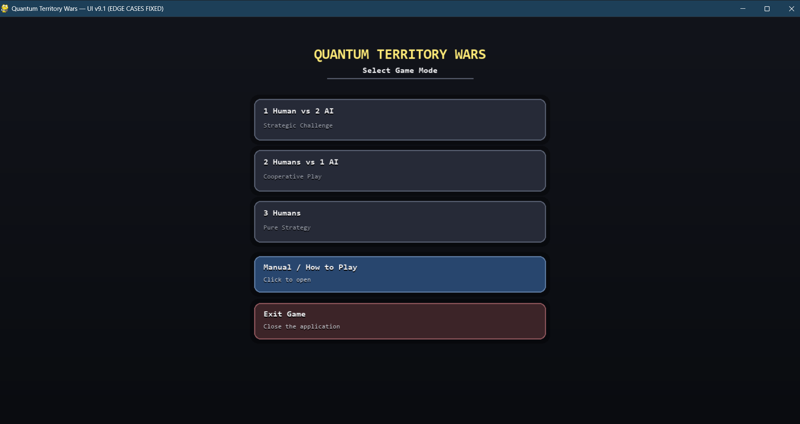
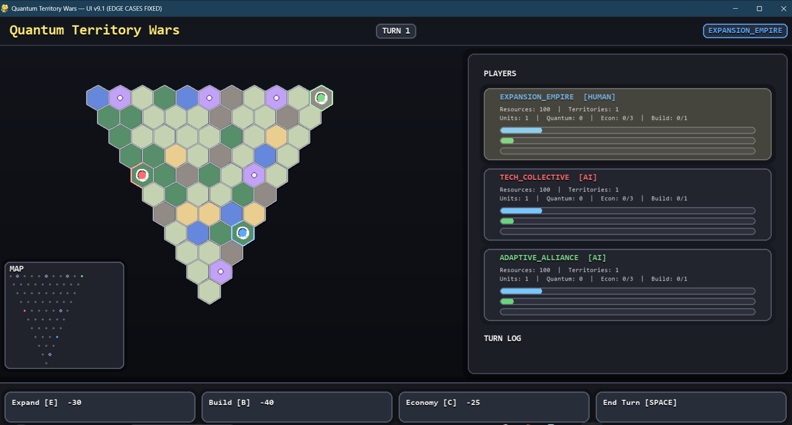

# Quantum Territory Wars — Pygame Edition

Turn-based hex strategy with A\* pathfinding, a Minimax + Alpha‑Beta AI enhanced by a Fuzzy Logic evaluator, and an expressive Pygame UI.

## ✨ Overview

Quantum Territory Wars is a finished single-/multiplayer turn-based strategy game implemented in Python using Pygame. Players (human or AI) claim hexes on an 11×11 triangular hex map, compete for five special Quantum Nodes, and manage resources to pursue one of three victory conditions: Territorial, Quantum, or Economic. The game pairs a handcrafted 2D UI with deterministic AI (minimax with alpha‑beta pruning) and a fuzzy scoring system that balances economy, territory control and military strength.

## 🎯 Key Features

- Deterministic hex-grid gameplay with an 11×11 triangular layout and exactly 5 randomly placed Quantum Nodes.
- Responsive Pygame UI: dynamic layout, scalable fonts, minimap, tooltips, overlays, and rich visual indicators.
- A\* pathfinding for unit movement that respects terrain costs and ownership penalties.
- Minimax AI (depth‑2) with Alpha‑Beta pruning and a Fuzzy Logic evaluator that scores states by Resources, Territories, Quantum Nodes and Units.
- Three clear victory paths: Territorial (18 hexes), Quantum (all 5 Quantum Nodes), Economic (600 resources).
- Economy mechanics including base income (+10) and territory bonus (+2 per hex), plus an `Economy` action (spend 25 → gain 40) and limited-use mechanics.

## 🛠️ Tech Stack & Tools

- Languages: Python (project codebase is Python source).
- Frameworks & Libraries: `pygame==2.5.2` (see `requirements.txt`).
- Infrastructure: Single-file desktop game (no external infra required).
- Dev Tools: Standard Python tooling (pip), any editor (VS Code recommended). No tests or CI detected in repository.

## 📂 Project Structure (simplified)

```
Quantum_Territory_War/
├─ README.md                     # (this file)
├─ QUANTUM_TERRITORY_WARS_GUIDE.md# Gameplay guide / manual (detailed rules)
├─ requirements.txt              # Runtime dependency (pygame==2.5.2)
└─ updated.py                    # Complete game implementation (Pygame UI + game logic)
```

- `updated.py` — The full game: data models, board generation, A\* pathfinding, fuzzy evaluator, minimax AI, UI rendering and the main loop.
- `QUANTUM_TERRITORY_WARS_GUIDE.md` — Human-focused manual that describes rules, controls, strategy and tutorial material.

## 🚀 Getting Started

Follow these steps to run the game locally.

Prerequisites

- Python installed (a modern Python 3.x where `pygame` is supported).
- `pip` available.

Installation

```powershell
cd path\to\project
pip install -r requirements.txt
```

Run the game

```powershell
python updated.py
```

Environment variables

- None required by the code. The game runs standalone with the included source and `pygame`.

Notes

- The UI runs in a resizable Pygame window and provides a Title/Menu screen to choose 1/2/3 player modes.

## 📸 Showcase / Screenshots

```markdown


```

## 💡 Design Decisions & Architecture Notes

1. Single-file, clear separation of concerns: Although implemented in one file (`updated.py`), the code intentionally separates model/data (dataclasses like `Hex`, `Unit`, `Player`), algorithms (`AStar`, `FuzzyEvaluator`, `MinimaxAI`), and UI helpers (layout, drawing functions, overlays). This keeps the runtime simple to run while preserving modular reasoning for developers who want to extract components later.

2. Algorithm choices:

- A\* pathfinding for unit movement is a natural fit for hex maps with variable terrain costs; the implementation uses axial coordinates and accounts for unit-type movement modifiers.
- The AI uses a depth‑2 Minimax with Alpha‑Beta pruning for tractable decision-making, combined with a Fuzzy Logic evaluator. The fuzzy approach lets the AI weigh tradeoffs (resources vs. territory vs. units vs. quantum nodes) in a graded way rather than brittle heuristics.

3. UI decisions:

- Built on Pygame to keep the app self-contained and desktop-friendly; the UI includes responsive layout logic (dynamic `HEX_SIZE`, font scaling) so the game remains usable across window sizes.
- Visual affordances such as tooltips, progress bars and overlays (manual, confirm, game over) prioritize clarity for players.

4. Economy & balance considerations:

- The `Economy` action (cost 25, gain 40) is implemented as an explicit short-term resource boost with limited uses. Territory yields passive income (+2 per hex), which creates a meaningful tradeoff between expansion and immediate gains.

## ▶️ How the AI evaluates moves (brief)

- The `FuzzyEvaluator` maps raw quantities (resources, territories, quantum nodes, units) into fuzzy sets and infers a score mapped to crisp strengths (Poor/Fair/Good/Excellent). The MinimaxAI uses this to compare game states and applies crisp bonuses when a player is near victory.

## 📬 Contact & Attribution

Built with by MDTAHSINURRAHMAN and Anirban Ghosh Argha.

If you'd like help splitting `updated.py` into modules, adding unit tests, or preparing an installer / executable (PyInstaller), open an issue or ask in this repo.
